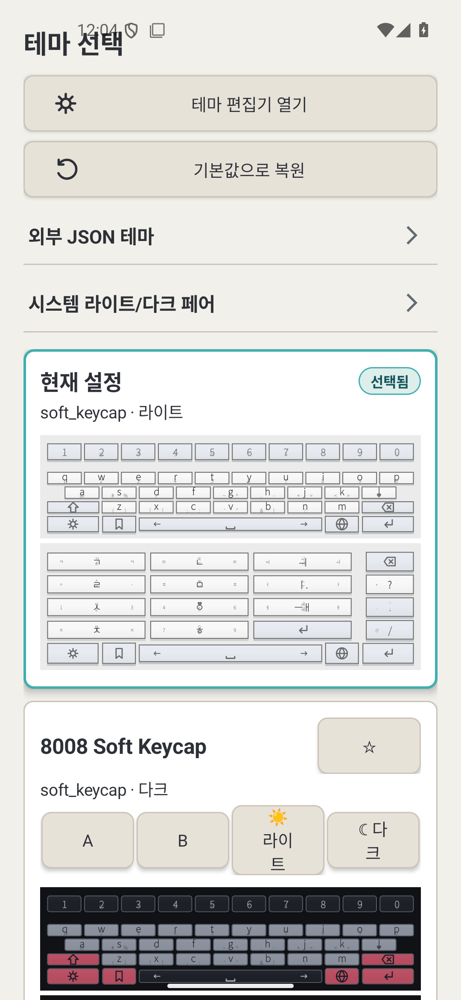
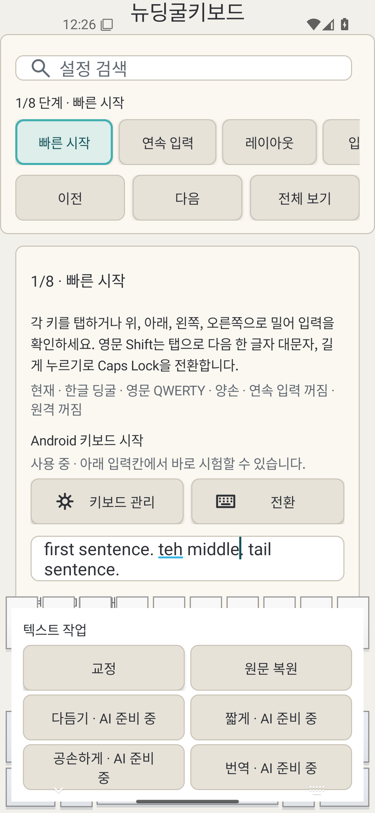
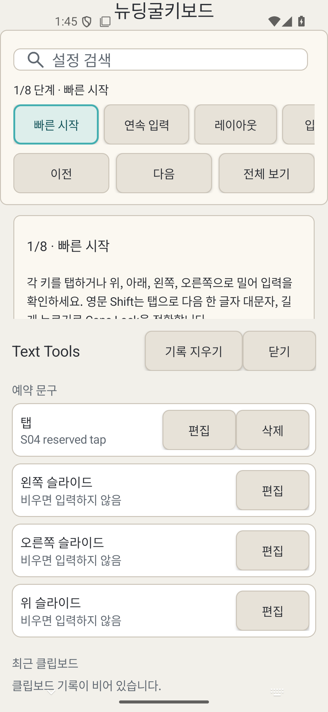
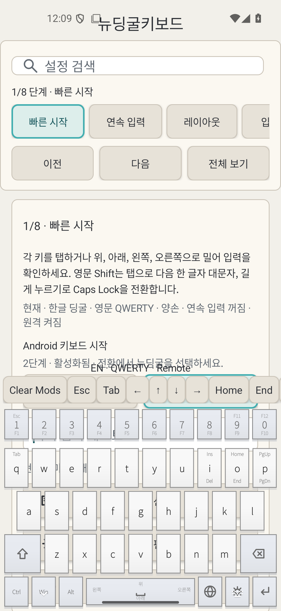
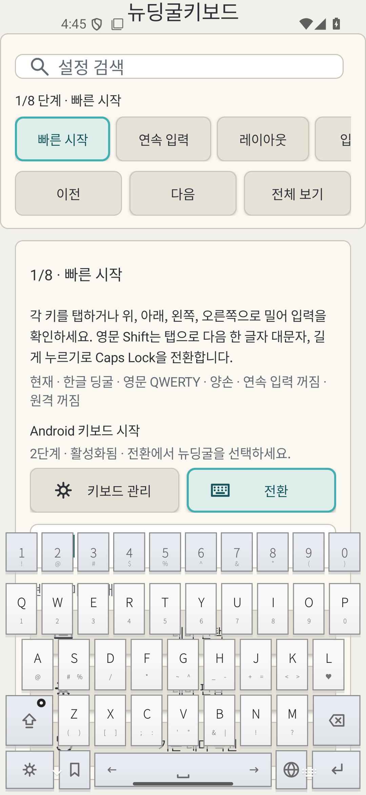

# 뉴딩굴키보드 시각 가이드

Updated: 2026-09-03 KST

이 문서는 현재 `main`의 실제 에뮬레이터 캡처를 기준으로 앱이 어떻게 보이고, 각 화면이 어떤 역할을 하는지 설명한다. 기능 전체 목록은 `docs/feature-catalog.md`를 함께 참고한다.

## 1. 전체 디자인 언어

뉴딩굴키보드는 Android IME와 설정 앱을 하나의 제품처럼 보이게 구성한다. 설정 화면은 밝은 중성색 배경, 얇은 회색 외곽선, 큰 둥근 카드와 명확한 선택 강조를 사용한다. 키보드 자체는 이 설정 UI와 분리되어 42개 테마를 적용할 수 있고, QWERTY와 Dingul 미리보기를 동시에 제공한다.

설정 앱의 핵심 구조는 상단 검색창 아래에 `빠른 시작 / 연속 입력 / 레이아웃 / 입력감 / 표시 ...` 단계 탭을 배치하고, 아래 카드에 선택한 단계의 설명과 설정을 보여주는 방식이다. 현재 선택 상태는 청록색 계열 outline과 옅은 배경으로 구분되어 작은 화면에서도 현재 위치를 바로 알 수 있다.

## 2. 테마 선택 화면

테마 선택 화면은 상단에 `테마 편집기 열기`, `기본값으로 복원`, 외부 JSON 테마, 시스템 라이트/다크 페어 설정을 배치한다. 그 아래 카드마다 테마 이름, 재질과 명암 분류, 즐겨찾기 버튼, QWERTY/Dingul 미리보기를 함께 보여준다.

현재 설정 카드는 청록색 outline과 `선택됨` 배지로 구분된다. 미리보기는 실제 레이아웃 구조를 축소해 보여주므로 색만 비교하는 목록이 아니라 숫자줄, modifier, Dingul 4x3 입력부와 하단 제어열까지 한 번에 비교할 수 있다.

## 3. 텍스트 작업 패널

Enter 제스처로 여는 텍스트 작업 패널은 키보드 창 안쪽에 겹쳐 나타난다. `교정 / 원문 복원 / 다듬기 / 짧게 / 공손하게 / 번역`을 2열 버튼으로 배치해 엄지 이동 거리를 줄였다. 선택 영역이나 현재 문장을 대상으로 처리하며, AI/provider 작업은 결과를 바로 입력하지 않고 미리보기와 적용 단계를 거친다.

패널이 별도 팝업 창이 아니라 IME 내부 surface에 있으므로 텍스트 입력 focus를 빼앗지 않는다. password, number, raw-key, Remote 등 민감하거나 비호환인 입력란에서는 이 surface 자체가 노출되지 않는다.

## 4. Text Tools

Text Tools는 예약 문구와 최근 클립보드를 한 화면에 묶는다. 예약 문구는 탭/왼쪽/오른쪽/위 슬라이드 슬롯별로 편집할 수 있고, 항목별 편집·삭제와 전체 기록 삭제가 독립적으로 제공된다. 최근 클립보드는 최대 10개를 관리하며 민감 필드에서는 기록과 사용이 차단된다.

## 5. Windows Remote 모드

Remote 모드에서는 일반 테마 장식보다 PC 원격 조작의 가독성을 우선한다. 숫자줄에는 F1~F12와 Esc 보조 표기를 배치하고, 문자 키에는 Tab/Insert/Delete/Home/End/Page 계열 slide 기능을 작게 표시한다. 하단은 `Ctrl / Win / Alt / Space / Lang / Menu / Enter` 순서로 고정된다.

키보드 위에는 `Clear Mods`, Esc, Tab, 방향키, Home, End 같은 빠른 toolbar가 나타난다. Ctrl/Win/Alt/Shift는 one-shot 또는 lock 상태로 조합할 수 있고 `Clear Mods`로 즉시 초기화한다. Android 측 KeyEvent 생성과 실제 Windows 수신 여부는 별도로 기록한다.

## 6. QWERTY 입력 상태

영문 QWERTY는 일반적인 키 배열을 유지하면서 slide hint와 상태 피드백을 더한다. Shift tap은 다음 한 글자만 대문자로 만들고 long-press는 Caps Lock을 전환한다. Caps 상태에서는 대문자 legend와 lock 표식이 함께 바뀌어 상태를 시각적으로 확인할 수 있다.

Space 좌우 slide는 커서 이동, Backspace slide는 단어 단위 삭제에 사용된다. 영어 입력 보조는 현재 단어 후보와 안전한 exact typo correction을 제공하지만, password/URL/raw 등 편집기 정책에 따라 composing과 보조 기능을 제한한다.

## 7. Dingul 입력의 시각 구조

Dingul의 핵심 4x3 입력부는 각 키 중앙의 기본 문자와 상·하·좌·우 보조 legend를 함께 보여준다. 사용자는 같은 물리적 키에서 탭 또는 네 방향 slide로 다른 자모를 선택한다. 우측 특수 기능열과 하단 제어열은 역할색과 아이콘으로 구분되고, 테마가 바뀌어도 입력 geometry와 hit rectangle은 유지된다.

한 손가락 연속 입력을 켜면 손가락을 떼지 않은 채 `선택 → 확정 → 자유 이동 → 다음 키 선택` 흐름을 반복할 수 있다. 상태 행은 현재 언어, Dingul/QWERTY, Remote, Caps, 연속 입력 상태를 실제 적용값 기준으로 표시한다.

## 8. 설치 후 첫 사용

APK 설치 후 앱을 한 번 열고 `빠른 시작` 화면에서 Android 키보드 관리로 이동해 `뉴딩굴키보드`를 활성화한 뒤, `전환` 버튼 또는 시스템 입력기 선택기에서 뉴딩굴키보드를 선택한다. 같은 화면의 연습 입력란에서 실제 IME를 즉시 확인할 수 있다.

GitHub에 제공하는 설치용 베타 APK는 Android debug signing으로 서명된 테스트 배포물이다. APK 자체는 설치 가능하지만 Play/정식 closed-beta용 production signing과는 별개다. 정식 release 서명은 저장소 밖의 closed-beta keystore가 제공된 뒤 `scripts/build-release.ps1` 경로를 사용한다.

## 9. 구현/검증 상태

현재 S01~S09 repository engineering은 완료 상태다. 자동 gate는 42개 내장 테마, `solid / soft_keycap / frosted / acrylic` 4개 재질, KeyboardSettings 70개 필드 사용 감사, unit tests, lint, debug assemble을 검사한다. Dingul typing smoke, 일반/민감/웹 입력 field, Chrome/Google Messages surface와 대표 테마 geometry도 에뮬레이터에서 확인됐다.

저장소 밖에서 남는 항목은 production signing keystore, 실제 Windows Remote receiver 수신 확인, 실기기 장시간 입력/TalkBack 확인, 최종 배포 연락처 메타데이터다.
